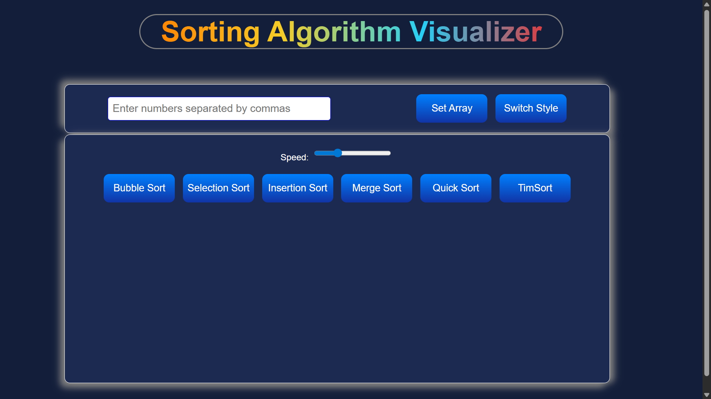
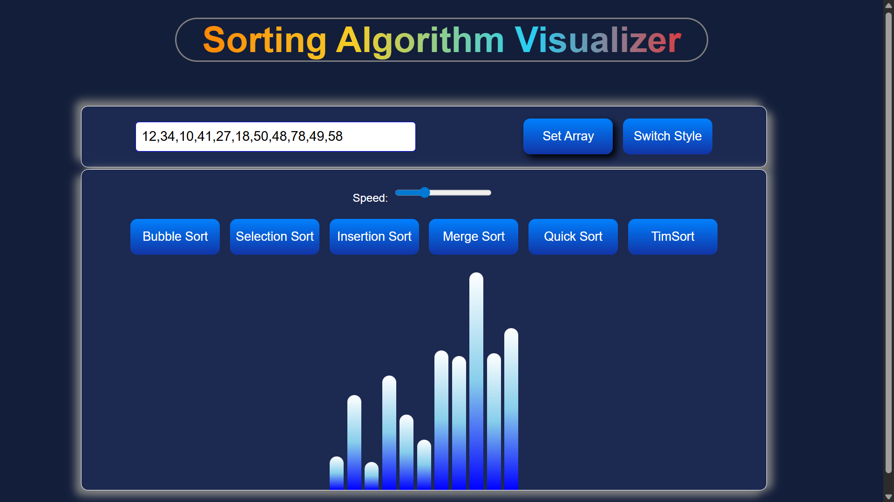
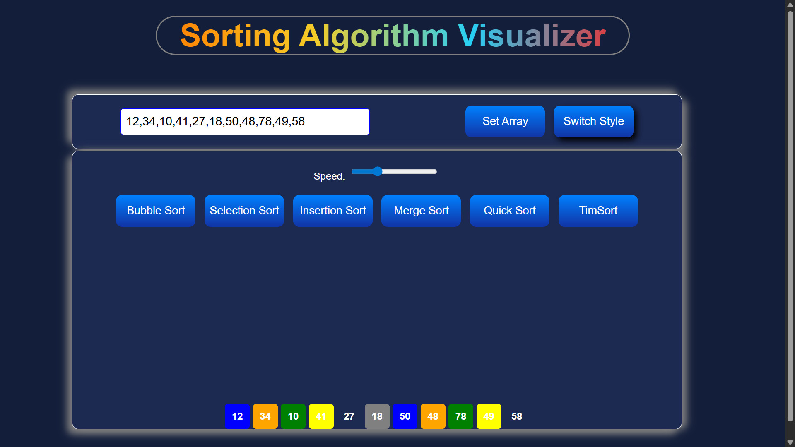
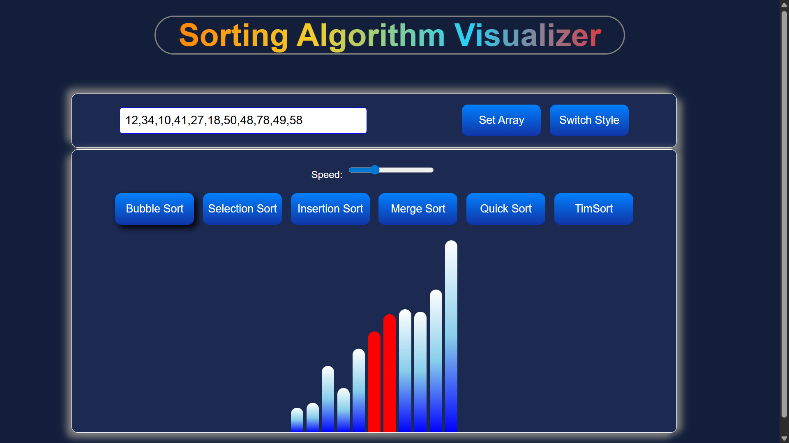

# 🎉 Sorting Algorithm Visualizer

A beautiful, interactive, and animated **Sorting Algorithm Visualizer** built using **HTML, CSS, and JavaScript**.  
This tool helps you understand how sorting algorithms work step-by-step with smooth animations and customizable views.

---

## ✨ Features

- 🔢 Enter custom numbers  
- 🎨 Switch between **Box view** and **Bar view**  
- ⚡ Adjustable sorting speed  
- 🔁 Real-time visualization  
- 🟥 Highlights compared elements  
- 🎯 Clean UI with gradient styling  

---

## 🧠 Supported Sorting Algorithms

- 🔵 Bubble Sort  
- 🟠 Selection Sort  
- 🟢 Insertion Sort  
- 🟡 Merge Sort  
- 🔴 Quick Sort  
- ⚙️ TimSort (JavaScript built-in optimized sort)

---

## 🛠 Tech Stack

| Technology | Purpose |
|-----------|---------|
| 🌐 HTML | Structure of the application |
| 🎨 CSS | Styling, layout & UI design |
| ⚙️ JavaScript | Sorting logic & animations |

---

## 🚀 How to Use

1. Enter numbers separated by commas  
2. Select a sorting algorithm  
3. Adjust the speed (optional)  
4. Click the button and watch the animation happen ✨  
5. Toggle between **Bar mode** and **Box mode** anytime

---
## 📸 Screenshorts
        

